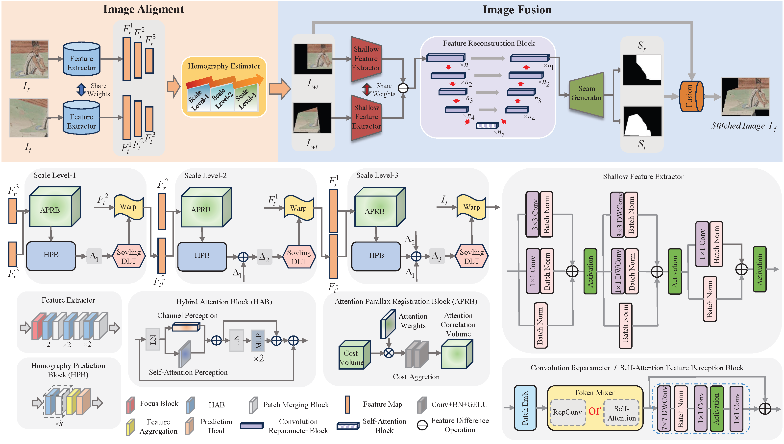

# <p align="center">DunHuangStitch: Unsupervised Deep Image Stitching of Dunhuang Murals</p>
<p align="center">Yuan Mei*, Lichun Yang', Mengsi Wang*, Tianxiu Yu`, Kaijun Wu*</p>
<p align="center">* the School of Electronic and Information Engineering, Lanzhou Jiaotong University</p>
<p align="center">' the Key Lab of Opt-Electronic Technology and Intelligent Control of Ministry of Education, Lanzhou Jiaotong University</p>
<p align="center">` Institute of Digitization of Cultural Relics, Dunhuang Research Institute</p>


## Dataset (Synthetic dunhuang dataset)
We use the synthetic dunhuang dataset to train and evaluate our method. To gain access to this dataset, please contact the author via email for specific details, as it is subject to private permissions requirements. 

Some of the data has been previously made available as open source, please see the [links](https://drive.google.com/file/d/1zqFX_gg6Pp4kf4PrmKB7NIojQDSxS3xr/view) for specific information.

## Dataset (Real dunhuang dataset)
We use the real dunhuang dataset to train and evaluate our method. To gain access to this dataset, please contact the author via email for specific details, as it is subject to private permissions requirements. 

## Dataset (Natural scene dataset)
We use the UDIS-D dataset to train and evaluate our method. Please refer to [UDIS](https://github.com/nie-lang/UnsupervisedDeepImageStitching) for more details about this dataset.


## Code
#### Requirement
numpy==1.22.4

opencv_python==4.5.5.64

timm==0.9.6

torch==1.12.1+cu116

torchvision==0.13.1+cu116


## Training on Dunhuang Synthetic Dataset
####  Step 1:Dataset preparation
Generate the dunhuang synthetic dataset. In our experiment, we generate 8,051 for training and 1,714 for testing.

Modify the 'sythetic_dh_dataset.py' to set the 'raw_image_path'/'generate_image_path' and create the corresponding folders. Then, run this script:
```
python sythetic_dh_dataset.py
```

#### Step 2:Unsupervised aligment
```
python train_homo_dunhuang128.py
```

#### Step 3:Generate the coarsely aligned images and content masks
```
python inference_homo_output.py
```

#### Step 4:Unsupervised fusion
```
python train_fuse.py
```

## Training on UDIS Dataset
Replace 'from net.dunhuang128_homo_model import HModel' in train_homo_udis512.py, inference_homo_output.py, train_fuse.py with 'from net.udis512_homo_mesh_model import HModel'. Similarly, the parser portion of the main function is replaced with the parameters required for training on the UDIS dataset. Also, change the parameters in the utils/constant.py file as needed.
#### Step 1:Unsupervised aligment
```
python train_homo_udis512.py
```

#### Step 2:Generate the coarsely aligned images and content masks
```
python inference_homo_output.py
```

#### Step 3:Unsupervised fusion
```
python train_fuse.py
```

## Testing 
Our pretrained aligment model and fusion model can be available at [Google Drive](https://drive.google.com/drive/folders/12fLswn9o8FVLoqewfHIWazhphBY3LD4h?usp=drive_link). This includes the pre-trained model on the Dunhuang dataset and the pre-trained model on the UDIS dataset.
#### Caculate the aligment performance calculation
```
python inference_homo.py
```
#### Caculate the stitching performance calculation
```
python inference_fuse.py
```

## Meta
If you have any questions about this project, please feel free to drop me an email.

Yuan Mei -- 2551161628@qq.com


